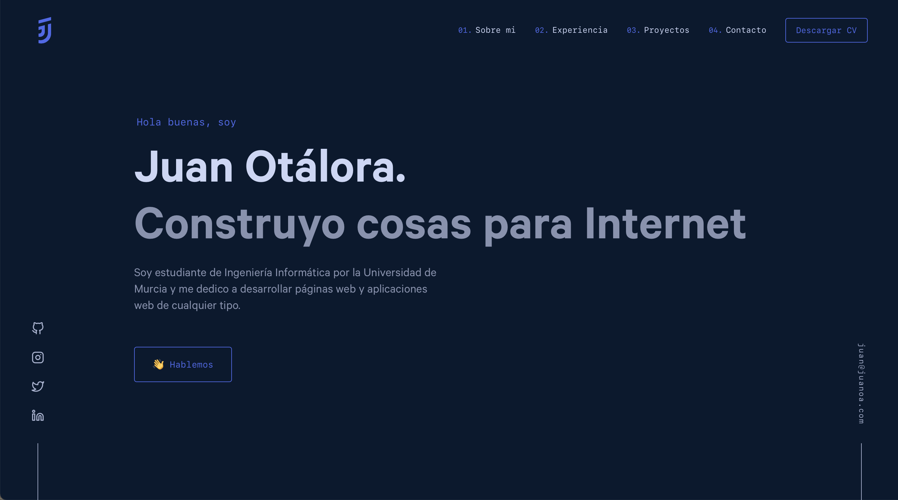

<div align="center">
  
</div>
<h1 align="center">
  cv.juanoa.com
</h1>
<p align="center">
  Mi CV personal desarrollado con Gatsby y con React por <a href="https://brittanychiang.com">brittanychiang.com</a>
  y editado por mi.
</p>
<p align="center">
  <a href="https://app.netlify.com/sites/cv-juanoa/deploys" target="_blank">
    
  </a>
</p>


## 📖 Documentación
Puedes consultar la documentación completa en [docs.juanoa.com](https://docs.juanoa.com/juanoa-cv/#/)

## 🛠 Instalación y puesta a punto

1. Instala el CLI de Gatsby

   ```sh
   npm install -g gatsby-cli
   ```

2. Instala y utiliza la versión correcta de Node con [NVM](https://github.com/nvm-sh/nvm)

   ```sh
   nvm install
   ```

3. Instala las dependencias

   ```sh
   npm i
   ```

4. Inicia el servidor de desarrollo

   ```sh
   npm start
   ```

## 🚀 Puesta en producción

1. Genera los archivos estáticos en `/build`

   ```sh
   npm run build
   ```

1. Obtén una vista previa antes de desplegar

   ```sh
   npm run serve
   ```
